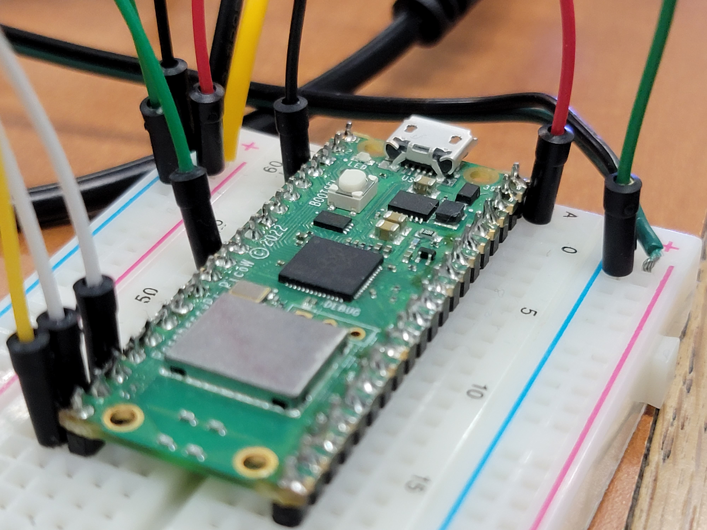

# WVLKWY

## CS530-Project

Hardware project involving Raspberry Pi Pico W, HCSR04 ultrasonic sensors, a Flutter application, and NeoPixels. Designed to turn on lights when motion is detected. Light color and alarm time are adjustable via the Flutter application. 

## Youtube
Check out our demo of the hardware here:
[]()
## Project Structure
```
$PROJECT_ROOT
#NAME?
|       temp
|       
\---pico_w_wlkway
    +---src
    |       alarm.py
    |       hcsr04.py
    |       lights.py
    |       main.py
    |       
    \---tests
            test_client.py
```
## License

Apache License

Check out [LICENSE](./LICENSE) for more detail.
