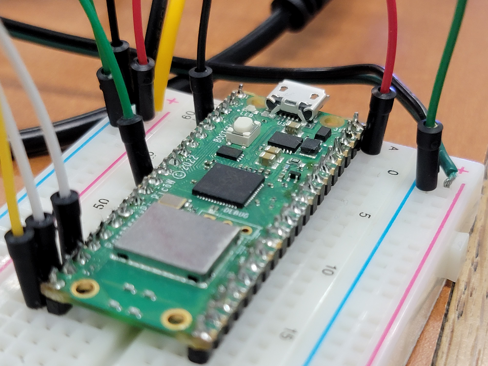
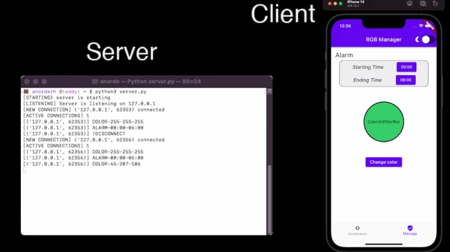

# WVLKWY

## CS530-Project

Hardware project involving Raspberry Pi Pico W, HCSR04 ultrasonic sensors, a Flutter application, and NeoPixels. Designed to turn on lights when motion is detected. Light color and alarm time are adjustable via the Flutter application. 

## DEMO Video
Check out our demo of the hardware here:
[]()

## Directions

### Turn On Device
1. Plug device into nearby wall outlet.
    - Device will autostart on default settings

### Connect App
1. Open the application
2. Connect to the devices IP
    - Device will light up when app is connected
3. Adjust alarm time and/or color to your liking
4. Tap select/ok to set the desired setting
5. Trip the motion sensors to see your new settings

Click the thumbnail below to see the app in action
[](https://www.youtube.com/watch?v=ykn369DWDXE)
## Project Structure
```
$PROJECT_ROOT
 +---flutter_wlkway
|   |   main.dart
|   |   
|   +---system
|   |       AppData.dart
|   |       Connection.dart
|   |       Networking.dart
|   |       notification_service.dart
|   |       theme_provider.dart
|   |       
|   \---widgets
|       |   .DS_Store
|       |   Base.dart
|       |   
|       +---buttons
|       |       ChangeThemeButton.dart
|       |       
|       \---pages
|               .DS_Store
|               Connections.dart
|               Manage.dart
|       
\---pico_w_wlkway
    +---src
    |       alarm.py
    |       hcsr04.py
    |       lights.py
    |       main.py
    |       
    \---tests
            test_client.py
```
## License

Apache License

Check out [LICENSE](./LICENSE) for more detail.
